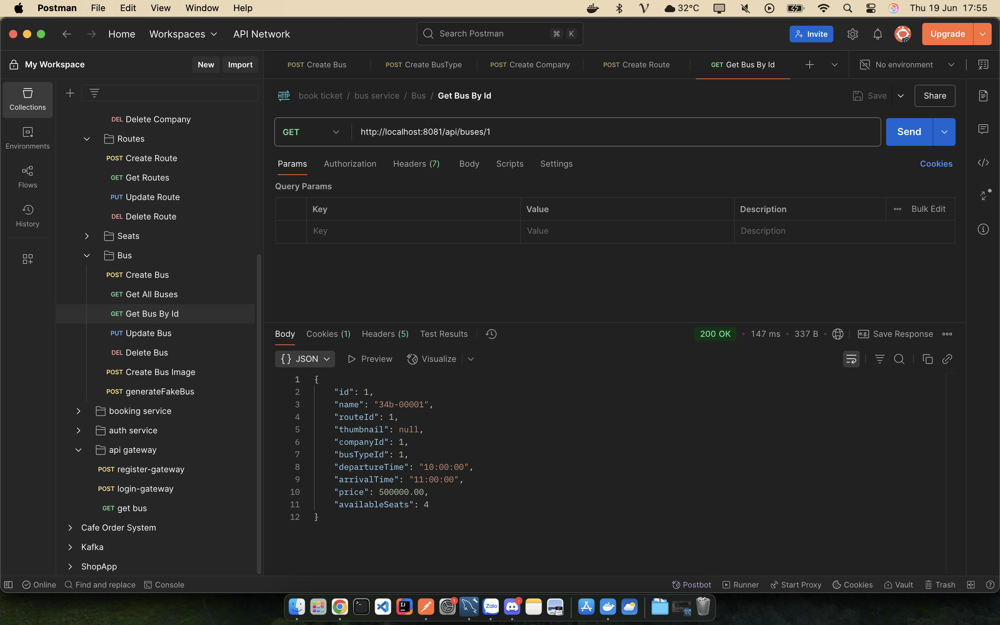
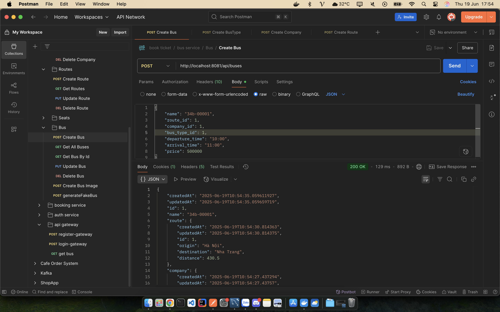
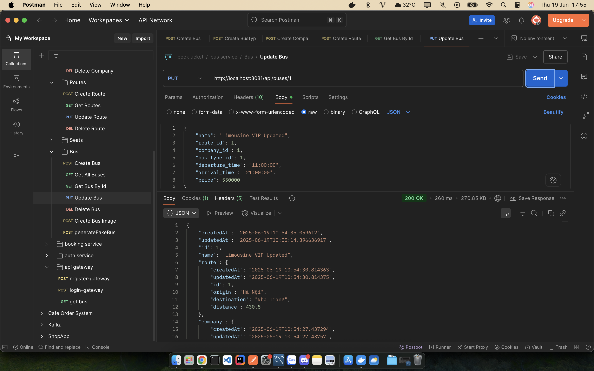
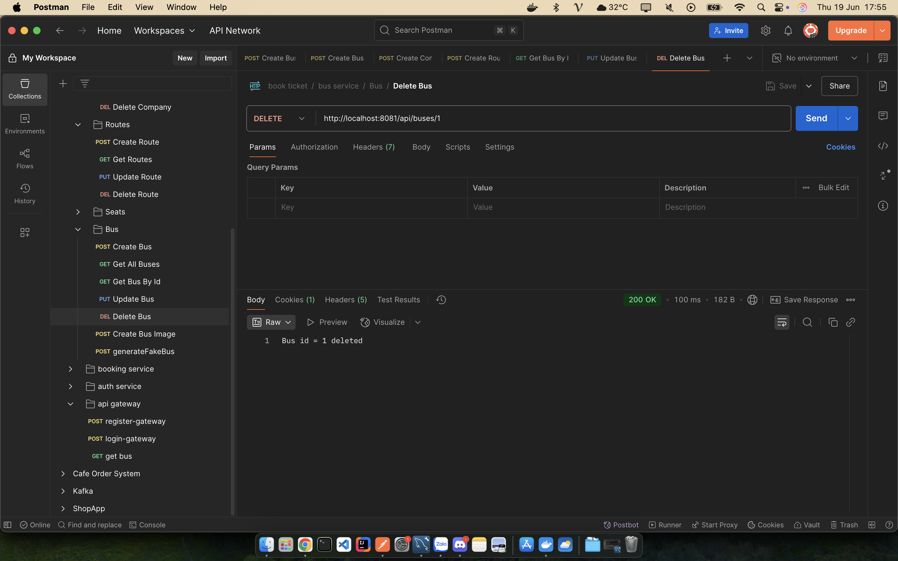

# Thực hành kiểm thử API bằng Postman

Bài thực hành này hướng dẫn cách kiểm thử API RESTful cơ bản với các phương thức GET, POST, PUT, DELETE bằng công cụ Postman, sử dụng API giả lập từ [JSONPlaceholder](https://jsonplaceholder.typicode.com) để mô phỏng dữ liệu xe bus.

## Mục tiêu
- Hiểu và thực hiện các thao tác cơ bản với API RESTful: GET, POST, PUT, DELETE.
- Sử dụng Postman để gửi request và kiểm tra phản hồi từ server.
- Viết các đoạn kiểm thử tự động trong Postman để xác nhận kết quả trả về.
- Thực hành gửi dữ liệu JSON và phân tích phản hồi.
- Hiểu luồng hoạt động cơ bản của hệ thống backend với các API.

## Công cụ và API sử dụng
- **Công cụ**: Postman
- **API giả lập**: [JSONPlaceholder](https://jsonplaceholder.typicode.com) (mô phỏng dữ liệu bài viết để thay thế cho dữ liệu xe bus)
- **Dữ liệu mô phỏng**: Các bài viết (`posts`) được sử dụng để đại diện cho thông tin xe bus.

## Các request đã tạo
| Phương thức | Endpoint | Chức năng |
|-------------|----------|-----------|
| GET | `http://localhost:8081/api/buses/id` | Lấy thông tin chi tiết xe bus theo ID |
| POST | `http://localhost:8081/api/buses` | Tạo xe bus mới |
| PUT | `http://localhost:8081/api/buses/id` | Cập nhật xe bus theo ID |
| DELETE | `http://localhost:8081/api/buses/id` | Xóa xe bus đã tạo |

> **Lưu ý**: Trong bài thực hành, các endpoint thực tế sử dụng `https://jsonplaceholder.typicode.com/posts` để thay thế cho `http://localhost:8081/api/buses`.

## Chi tiết các request

### 1. GET /buses – Lấy danh sách tất cả xe bus
**Mục đích**: Lấy danh sách các xe bus hiện có trong hệ thống.



- **Method**: GET
- **Endpoint**: `https://jsonplaceholder.typicode.com/posts`
- **Phản hồi**: Trả về một mảng JSON chứa thông tin các xe bus (mô phỏng bởi danh sách bài viết).
- **Kiểm thử**:
  - Kiểm tra mã phản hồi là `200 OK`.
  - Xác nhận dữ liệu trả về là một mảng JSON.

**Test script trong Postman**:
```javascript
pm.test("Lấy danh sách xe bus thành công", () => {
    pm.response.to.have.status(200);
    pm.expect(pm.response.json()).to.be.an('array');
});
```

**Kết quả mẫu**:
```json
[
  {
    "userId": 1,
    "id": 1,
    "title": "...",
    "body": "..."
  },
  ...
]
```

### 2. POST /buses – Tạo xe bus mới
**Mục đích**: Gửi dữ liệu từ client để tạo xe bus mới trên hệ thống.



- **Method**: POST
- **Endpoint**: `https://jsonplaceholder.typicode.com/posts`
- **Payload** (JSON ví dụ):
```json
{
  "licensePlate": "51B-12345",
  "route": "HCM - Đà Nẵng",
  "seats": 40
}
```
- **Kiểm thử**:
  - Kiểm tra mã phản hồi là `201 Created`.
  - Xác nhận nội dung trả về chứa thông tin xe bus vừa tạo.

**Test script trong Postman**:
```javascript
pm.test("Tạo xe bus mới thành công", () => {
    pm.response.to.have.status(201);
    pm.expect(pm.response.json()).to.have.property('id');
    pm.expect(pm.response.json().licensePlate).to.equal('51B-12345');
});
```

**Kết quả mẫu**:
```json
{
  "licensePlate": "51B-12345",
  "route": "HCM - Đà Nẵng",
  "seats": 40,
  "id": 101
}
```

### 3. PUT /buses/1 – Cập nhật thông tin xe bus
**Mục đích**: Cập nhật lại thông tin của xe bus theo ID.



- **Method**: PUT
- **Endpoint**: `https://jsonplaceholder.typicode.com/posts/1`
- **Payload** (JSON ví dụ):
```json
{
  "id": 1,
  "licensePlate": "51B-67890",
  "route": "HCM - Hà Nội",
  "seats": 42
}
```
- **Kiểm thử**:
  - Kiểm tra mã phản hồi là `200 OK`.
  - Xác nhận nội dung trả về chứa thông tin xe bus đã cập nhật.

**Test script trong Postman**:
```javascript
pm.test("Cập nhật xe bus thành công", () => {
    pm.response.to.have.status(200);
    pm.expect(pm.response.json().licensePlate).to.equal('51B-67890');
});
```

**Kết quả mẫu**:
```json
{
  "id": 1,
  "licensePlate": "51B-67890",
  "route": "HCM - Hà Nội",
  "seats": 42
}
```

### 4. DELETE /buses/1 – Xóa một xe bus
**Mục đích**: Xóa một xe bus khỏi hệ thống dựa theo ID.



- **Method**: DELETE
- **Endpoint**: `https://jsonplaceholder.typicode.com/posts/1`
- **Request body**: Không cần gửi.
- **Phản hồi**: Mã `200 OK` nếu xóa thành công.

**Test script trong Postman**:
```javascript
pm.test("Xóa thành công", () => {
    pm.response.to.have.status(200);
});
```

**Kết quả mẫu**:
```json
{}
```

## Tổng kết
Qua bài thực hành này, đã thực hiện:
- ✅ Thực hiện các thao tác cơ bản với API RESTful: GET, POST, PUT, DELETE.
- ✅ Sử dụng Postman để gửi request và kiểm tra phản hồi từ server.
- ✅ Viết các đoạn kiểm thử tự động trong Postman để xác nhận kết quả trả về.
- ✅ Thực hành gửi dữ liệu JSON và phân tích phản hồi.
- ✅ Hiểu luồng hoạt động cơ bản của hệ thống backend với các API.

**Ưu điểm của việc sử dụng JSONPlaceholder**:
- 🚀 An toàn, không ảnh hưởng đến dữ liệu thật.
- 🚀 Dễ dàng thực hành các thao tác CRUD mà không cần thiết lập server.
